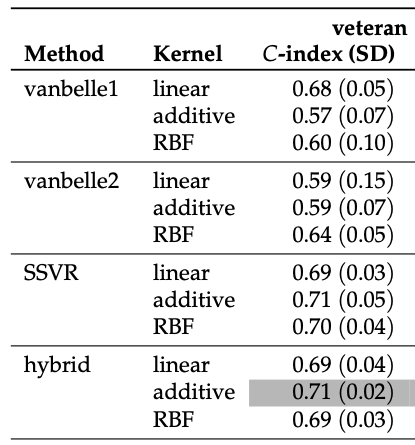

```{=html}
<style>
h1.title, h4.author, h4.date {
  text-align: center;
}

body {
  text-align: justify;
  font-family: "Times New Roman";
  font-size: 15px;
}

</style>
```

------------------------------------------------------------------------

```{r setup, include=FALSE}
knitr::opts_chunk$set(echo = TRUE)
```

## Introduction

Every day, we live a life of unpredictable outcomes in a world full of uncertainties. Amidst this chaos, our survival itself can sometimes feel like a matter of fate or chance. Yet, behind every journey of survival - whether it is a patient undergoing treatment, a startup navigating its early years, or even a machine outlasting its warranty - lies a series of patterns that can be analyzed, leading to new insights. This statistical procedure, which is dedicated to examining and predicting the duration of time until a specific event (or multiple events) occurs, is known as survival analysis. Survival analysis is used with a binary or dichotomous outcome of interest[^1]: success and failure, life and loss, managing to finish a Netflix series before all my free trials run out. It provides a framework to predict and understand such outcomes across fields like healthcare, engineering, and finance. As *The Hunger Games* stated, "May the odds be ever in your favor." Luckily for us, survival analysis can help us understand those odds, not merely hope for them.

[^1]: Huecker, Shreffler, Jacob. “Survival Analysis.” StatPearls [Internet]., U.S. National Library of Medicine, 22 May 2023, www.ncbi.nlm.nih.gov/books/NBK560604/.

This report delves into the research presented in *“Support Vector Machines for Survival Analysis with R”* by Césaire J. K. Fouodo, Inke R. König, Claus Weihs, Andreas Ziegler, and Marvin N. Wright, with an expanded focus on new analyses and practical applications of survival SVMs. In the original study, the authors identified limitations in traditional survival analysis methods, such as the Cox Proportional Hazards model, when applied to high-dimensional datasets. These methods often rely on assumptions that may not always hold true and require and demand very high computational power. To overcome these challenges, the researchers proposed the use of support vector machines (SVMs) as an alternative approach.

Building upon the foundational methods described in the paper, this report recreates the analysis by implementing survival SVMs with various kernels and approaches (e.g., regression, Vanbelle, and hybrid methods). This report goes into a detailed evaluation of model performance—with comparisons for various C-index values (further explored later in this paper)—and extends the analysis by exploring hyperparameter tuning and visualizations. This report aims to provide deeper insights into the strengths and practical limitations of survival SVMs. Furthermore, we address the ethical implications and potential impacts of the use of such technology especially in the medical sphere and how it can be regulated.

## Analysis of Statistical Methods

### Overview of Analysis Methods

The paper presents three distinct approaches to implementing SVMs for survival analysis. As we know, SVMs, at their core, work by finding an optimal separating line/hyperplane between different classes of data points, essentially maximizing the margin between these classes. However, survival analysis presents a unique challenge due to censoring - this is when the actual survival time is unknown because the event occurs beyond the time limit of the study period.[^2] By adapting SVMs to handle such data, the authors offer an alternative to traditional methods in survival analysis.

[^2]: Clark, T G, et al. “Survival Analysis Part I: Basic Concepts and First Analyses.” *British Journal of Cancer*, vol. 89, no. 2, July 2003, pp. 232–238, dx.doi.org/10.1038%2Fsj.bjc.6601118, <https://doi.org/10.1038/sj.bjc.6601118.> Accessed 28 June 2019.

The first approach is the regression approach. While traditional regression penalizes all predictions that deviate from true values, censored and uncensored data are treated differently under this approach. The model penalizes the predictions that differ from actual survival time only for uncensored observations. For censored observations, the model only penalizes predictions that fall below the censoring time, as any prediction above this time could potentially be accurate. This allows the model to learn from incomplete data while preserving information from censored observations and improving overall accuracy.

The second method they introduced is the ranking approach. "This approach considers survival analysis based on SVMs as a classification problem with an ordinal target variable."[^3] - unlike the previous method, where we predict the exact survival time, this method focuses on predicting the order or ranking of survival times among individuals. In this manner, they predict which individuals are more likely to experience an event sooner than others. The outcome is not just a binary classification but an ordered sequence of who is at higher risk.

[^3]: R. Herbrich, T. Graepel, and K. Obermayer. Support vector learning for ordinal regression. In 9th International Conference on Artificial Neural Networks (ICANN99), pages 97–102, 1999. URL <https://dx.doi.org/10.1049/cp:19991091.> [p414]

Under this approach, the model aims to maximize the C-Index or Concordance Index defined by Van Belle[^4], which is essentially a measure of how well the model ranks survival times. This approach of relative ordering rather than predicting exact survival times is applicable in the medical sphere and its finite resources.

[^4]: V. Van Belle, K. Pelckmans, J. Suykens, and S. Van Huffel. Support vector machines for survival analysis. In Proceedings of the Third International Conference on Computational Intelligence in Medicine and Healthcare (CIMED2007), pages 1–8, 2007. [p413, 414, 415]

Lastly, we have the hybrid approach, which combines the strengths of both regression and ranking methods. This is to balance the output between precise time estimates and relative risk ordering. While this output is certainly more informative, it comes at a computational cost. This is because it results in a much more complex quadratic optimization problem, as laid out in the paper. While this method is more computationally expensive, it also achieves superior performance by leveraging the strengths of both the previous methods according to the results presented by the researchers.

The authors tested their methods using five different datasets, each chosen to represent different scenarios in survival analysis. The primary datasets include Veteran's lung cancer trial study, the Interpretation of Trial Stopped Early study, the Germany Breast Cancer Study Group 2, and the Mayo Clinic Lung Cancer study. This allowed them to test their methods across different dataset sizes and medical fields. In this process, each dataset was randomly divided into five approximately equal subsamples. For each iteration, one subsample served as the test set while the remaining data was used for training. Performance was primarily evaluated based on the C-index, a widely used metric in survival analysis.

The following table shows the results from the original paper that we will be using to compare our recreated results with. Each of these values was calculated using the `quadprog` optimizer in the `survivalsvm` package, which is what we will also use in all of our analysis.

::: {style="text-align: center;"}
{width="233"}
:::

### Survival SVM Approaches on Full Dataset

Building on the methodologies outlined in the paper, we will now delve into the practical implementation and recreation of the survival SVM approaches. To ensure a comprehensive evaluation, I implemented the regression, ranking (Vanbelle1), and hybrid approaches across three distinct kernel types: linear, radial basis function (RBF), and additive kernels. These methods were applied to the publicly available Veterans’ Administration Lung Cancer (veteran) dataset, which presents survival times for patients with advanced lung cancer. This dataset provides a mix of censored and uncensored observations, making it an ideal option for survival analysis.

To approach the regression method described in the paper correctly, I did a preliminary test using the linear kernel on the `veteran` dataset. This initial run yielded a Concordance Index (C-Index) of 0.7075193, which closely aligned with the corresponding value of 0.69 reported in the original study. This similarity provided an early indication that the method had been successfully implemented and was functioning as intended.

Following this preliminary test, I implemented the initial methods using the full veteran dataset. Starting with the regression method, I tested it across all three kernel types—linear, RBF, and additive—. For each kernel, the C-Index was calculated to assess the predictive accuracy of the models. As seen in the figure below, the linear kernel achieved a C-Index of 0.71, the additive kernel outperformed slightly with 0.74, and the RBF kernel demonstrated the highest performance at 0.80. (Note: For the RBF kernel, I was unable to change the `sigma` value and therefore we are using the default value across all our tests.)

::: {style="text-align: center;"}

:::

Similarly, I implemented the Vanbelle1 approach using the full veteran dataset and evaluated its performance across the three kernel types—linear, additive, and RBF. vanBelle1 implements a ranking-based approach that focuses on pairwise comparisons between survival times. The results from my analysis are shown in the table below, with the linear and additive kernels both achieving a C-Index of 0.61, while the RBF kernel yielded a slightly lower value of 0.53. The RBF kernel introduces flexibility in modeling non-linear relationships in the data. While this flexibility is advantageous for datasets with non-linear patterns, it can lead to overfitting or suboptimal performance in datasets without such a structure. Additionally, the RBF kernel depends heavily on hyperparameter tuning, specifically the sigma parameter, which controls the smoothness of the decision boundary. Since we are using the default values here, it is possible we see suboptimal performance.

::: {style="text-align: center"}

:::

Lastly, I applied the hybrid approach to the full veteran dataset and evaluated its performance across the three kernel types. The hybrid approach requires the gamma.mu parameter to be specified as a vector of two numeric values. These values determine the relative importance of the regression and ranking components in the optimization process. Specifically, the first value in the gamma.mu vector represents the weight assigned to the regression component and the second value corresponds to the weight assigned to the ranking component, which prioritizes maximizing the C-Index. In later novel analysis, we experiment with various combinations of weights to obtain an optimal value.

As shown in the table below, the linear kernel achieved a C-Index of 0.70, while both the additive and RBF kernels performed slightly better with a C-Index of 0.73. Notably, these results show superior performance compared to the values reported in the original study, even though this implementation did not utilize a 5-fold cross-validation approach as the paper did. This suggests that the hybrid method effectively balances the strengths of both regression and ranking approaches.

::: {style="text-align: center"}

:::

### 5-fold Cross-Validation For All Approaches

Having done analysis on the full `veteran` dataset, I next replicated the 5-fold cross-validation approach outlined in the original study, beginning with the regression approach. The results of my 5-fold analysis are presented in the table below, showing a mean C-Index of 0.72 (0.04) for the linear kernel, 0.69 (0.04) for the additive kernel, and 0.52 (0.03) for the RBF kernel. Comparing these to the original study, where the linear kernel achieved a mean C-Index of 0.69 (0.03), the additive kernel reached 0.71 (0.05), and the RBF kernel scored 0.70 (0.04), some differences are quite clear.

Once again, the RBF showed the worst results, which can likely be attributed to hyperparameter tuning in the original. Additionally, some varation in splitting data across folds can introduce differences; even with the same number of folds, the random partitioning of data can yield slightly different training and test sets, which affects model training.

::: {style="text-align: center"}
::: {style="text-align: center"}

:::
:::

The 5-fold cross-validation results for the Vanbelle1 method resulted in mean C-Index values of 0.58 (SD: 0.04) for the linear kernel, 0.55 (SD: 0.08) for the additive kernel, and 0.53 (SD: 0.05) for the RBF kernel. Compared to the original study’s values of 0.68 (SD: 0.05) for the linear kernel, 0.57 (SD: 0.07) for the additive kernel, and 0.60 (SD: 0.10) for the RBF kernel, the current analysis generally underperformed, particularly with the linear and RBF kernels. The additive kernel did comparable with the original results.

::: {style="text-align: center"}
{width="327"}
:::

However, the hybrid approach is the one that we need to focus on. My initial run of the hybrid approach with equal gamma weights (0.5, 0.5) led to comparable performance for the linear and additive kernels: 0.70 vs 0.69 in original linear and 0.69 vs 0.71 in original additive, respectively. However the RBF kernel severely underperformed once again with only a mean C-Index value of 0.525. This was concerning given that the same weights were applied across all kernels. This called for some novel analysis that I have outlined below, which further explores the hybrid model and its performance in the RBF kernel specifically.

::: {style="text-align: center"}
{width="364"}


:::

Note: The above table shows the results for all the approaches in one consolidated table:

### Novel Analysis: Hybrid Approach

A big point of critique is that the paper does not explicitly state the exact ratio between regression and ranking used for the hybrid approach for any of the kernels. The gamma values ($\gamma_1$ and $\gamma_2$) are key parameters that control this balance. Without transparency in how these weights were determined or whether they were optimized for specific datasets, reproducing the results or comparing with other studies becomes challenging. To overcome this shortcoming, I conducted 5-fold cross-validation with various combinations of ratios and vouch for potential differences in results in the RBF kernel, as this was the most underperforming kernel.

I ran the test for 5 combinations of ( $\gamma_1$ and $\gamma_2$):

-   (0.5, 0.5) - Equal Regression and Ranking

-   (2, 0.5) - Prioritizes Regression

-   (0.5, 2) - Prioritizes Ranking

-   (1, 0.1) - Extreme Regression

-   (0.1, 1) - Extreme Ranking

    ::: {style="text-align: center"}
    
    :::

The results from each of those runs can be found in the `STOR390 Final.rmd` file under the Novel Analysis heading. The analysis of the RBF kernel in the hybrid method showed consistently poor performance across various gamma pairings, as illustrated in the graph. Despite testing multiple combinations of regression ( $\gamma_1$ ) and ranking ( $\gamma_2$ ) weights, the C-index values remained notably low, with minimal improvement across configurations. The highest C-Index value that we found was with the weights (0.5, 2), which makes sense as it prioritizes Ranking. But what is surprising is that (0.1, 1) performed quite poorly, with the majority of the priority going to Ranking. This suggests that Regression weight is still important and plays some role in helping gain a higher C-Index value.

But values with minimal difference across the board suggests that the RBF kernel struggled to generalize effectively within the veteran dataset under the hybrid approach. While the hybrid method is designed to balance precision and ranking, the RBF kernel’s performance appears particularly sensitive to hyperparameter choices, including gamma values and more importantly the RBF kernel’s `sigma` parameter, which governs its smoothness and complexity.

A significant shortcoming of the original paper is the lack of transparency regarding these critical hyperparameters. The authors do not specify the gamma pairings they used in their hybrid method, nor do they discuss the sigma parameter for the RBF kernel. These omissions make it challenging to replicate or contextualize their results, particularly given the poor RBF kernel performance observed in this analysis. Without such details, the robustness of the original results for the RBF kernel comes into question with such a high C-Index value, as subtle hyperparameter optimizations can have a significant impact. This highlights the importance of complete methodological transparency in studies relying on kernel-based methods, where performance can vary dramatically with tuning.

## Normative Consideration

While the development of such a sophisticated and complex survival analysis tool is technically very impressive, it raises deep concerns about their potential misuse in healthcare resources and allocation. However, I take the position that their use in critical healthcare decision-making must remain strictly assistive and not determinative. I take this stance standing on the principles of deontology and fairness based on need, both of which highlight the ethical obligation one has towards patients in treating them as individuals rather than just numbers on a sheet of paper. When healthcare systems face a lack of resources, perhaps during a crisis like a pandemic or in an everyday scenario like ICU availability, there might be an inclination to use a predictive algorithm such as this to automate the decision-making process. I firmly believe that the purpose behind such tools is to assist medical professionals in their decision-making process, not replace it in its entirety. Such misuse of this model represents a serious ethical concern that demands scrutiny.

The use of such an algorithm also raises the subject of human dignity and autonomy. From a deontological perspective, healthcare professionals have a duty to treat every patient as an end in themselves, respecting their inherent dignity and worth. The fundamental issue lies in reducing human life to a mathematical probability with the use of an algorithm for final decison-making. Historical biases in medical datasets exacerbate this concern since commmunities of people that have historically had worse health outcomes due to the unavailability of care in their physical community would have lower survival predictions. The algorithm might interpret this as something inherent to the community rather than take into account the inequities they face. This can create a feedback loop with such members receiving less priority and further amplify the issue of disparate healthcare provisions.

The principle of fairness, specifically fairness based on need, demands that healthcare systems actively work to address disparities in their field, not reinforce them through automated decision-making. Allowing an algorithm to dictate how resources should be allocated would give results that are mathematically optimal but would likely be morally unjust. This is very dangerous as it is diminishing the human element of decision-making, which I believe to be absolutely crucial in a field like healthcare.

An opposing view might argue that predictive algorithms improve the objectivity and efficiency of decision-making. This is true in high-pressure situations where human bias and emotions can cloud our judgement. However, this argument does not account for the limitations of such algorithms in that the algorithm is only as unbiased as the data it is trained on. The systematic inequities in historical data basically ensure that no algorithm will ever be truly neutral. While objectivity is crucial, I would argue that human autonomy is paramount. Healthcare professionals must retain the freedom to make the final decision by including non-quantifiable measures (like a patient's expressed desires regarding care.)

Another critical normative concern relates to the privacy and security of patient data when employing predictive algorithms in survival analysis. These models require access to vast amounts of sensitive health information, including medical histories, demographics, and socioeconomic details, to make accurate predictions. Without proper safeguards, this data could be exposed to breaches or unauthorized access. Furthermore, questions arise about who controls and has access to this data—whether it is healthcare institutions, private companies, or governmental organizations. To prevent exploitation, strict regulatory frameworks must be established to govern the collection, storage, and use of patient data. Data encryption, anonymization, and restricted access are paramount while holding organizations accountable for any violations.

While predictive algorithms can serve as powerful tools for enhancing decison-making, their role must be carefully constrained to avoid undermining ethical principles. A good healthcare system is one that does not prioritize efficiency over equity, objectivity over compassion, and outcomes over humanity. The integration of these tools can surely positively impact the field, given that there is robust oversight, transparency, and clear accountability. There must be a commitment to continuous evaluation and improvement of the model while ensuring security of the patients' data.

Despite their statistical dominance, these algorithms cannot capture the complexity of human existence. A patient is much more than just a probability on a piece of paper. They are a human first. They have an identity to them - a parent, a spouse, a child, someone supporting their family, contributing to the community, etc. While one may argue that an algorithm can make a more "objective" decision as opposed to a human, perhaps it is this very ability to make questionable, non-optimal, emotional decisions that makes us human at all. An algorithm cannot replace the human essence.

# Conclusion

### Impact of Paper

The research conducted in “Support Vector Machines for Survival Analysis with R” by Fouodo et al. makes a significant contribution to the field of survival analysis by extending the applicability of machine learning techniques to address the limitations of traditional models like the Cox Proportional Hazards model. By introducing regression, ranking, and hybrid approaches tailored for survival data, the study lays a foundation for more robust analyses in high-dimensional datasets, where traditional methods struggle. These innovative methodologies enhance the ability to model complex relationships in censored survival data, potentially improving decision-making across the healthcare field. There are some aspects with regards to their methodologies that need to be clarified further that would allow for better further analyses in the future. By highlighting the versatility of SVMs, this paper paves the way for broader applications and adaptations of machine learning methods in survival analysis while also keeping in mind ethical considerations for the use of such technology in the healthcare field and its potential application in other fields as well. This dual impact underscores the significance of this study as both a technical and philosophical milestone in advancing survival analysis.

### Future Work and Wrap-Up

Building on the insights provided by Fouodo et al., several promising directions for future research emerge. First, further refinement of these methods is needed, particularly through more rigorous hyperparameter tuning, such as exploring gamma values in the hybrid method and sigma values for RBF kernels, to maximize their performance. Additionally, the reproducibility of this study could be enhanced by increased transparency regarding parameter choices and cross-validation procedures. Expanding these methods to larger, more diverse datasets would further validate their generalizability and address concerns about biases in the underlying data. This data does not necessarily have to be health related and can find potential applications in other fields.

In conclusion, while the study successfully introduces innovative machine learning approaches to survival analysis, it also raises important questions about the ethical implications of these tools, particularly in critical areas like healthcare resource allocation. Balancing technical advancements with ethical responsibility will be crucial as this field continues to evolve. Future research must not only refine the technical accuracy of such methods but also address the broader social and ethical challenges they present, ensuring these tools are used equitably and responsibly to benefit society as a whole.

\newpage

# References
